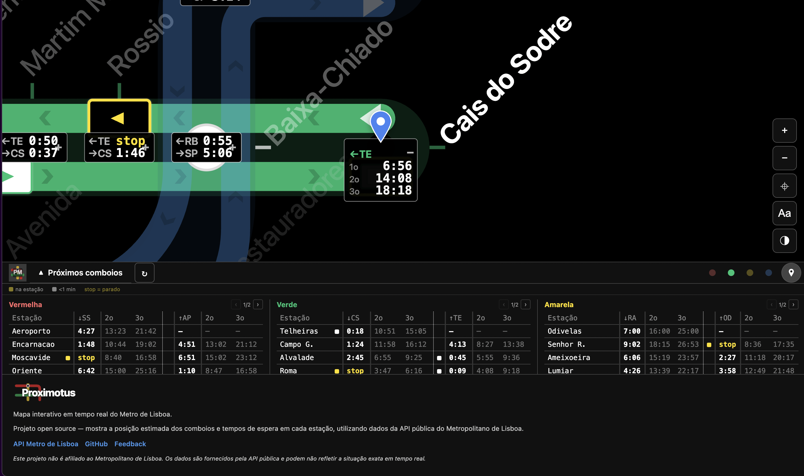

# Proximotus

<p align="center">
  
</p>

**Proximotus** — *proxima deslocação*, do latim — é uma aplicação web interactiva que apresenta o mapa do metro de Lisboa em tempo real.

<p align="center">
  
</p>

## Funcionalidades

- Mapa SVG interactivo com pan, zoom (scroll / pinch-to-zoom / botões)
- Posição estimada dos comboios em tempo real baseada nos tempos de espera da API
- Tempos de espera por estação e direção (até 3 próximos comboios)
- Linhas do metro de Lisboa: Azul, Amarela, Verde e Vermelha
- Toggle entre nomes completos e abreviações
- Geolocalização — encontra a estação mais próxima e faz zoom
- 3 temas: dark, light, high-contrast
- Painel inferior com tabela de tempos, legenda e refresh automático (5s)
- Otimizado para mobile e tablet (touch, safe areas, PWA)

## Stack

- React 19 + Vite 8
- SVG nativo (sem dependências de mapas)
- CSS puro (sem frameworks)
- API pública do Metropolitano de Lisboa (OAuth2)

## Desenvolvimento

```bash
npm install
npm run dev
```

O comando `dev` inicia um proxy local (porta 3001) para a API do Metro e o Vite dev server.

Necessita de um ficheiro `.env` com:
```
VITE_METRO_API_URL=/api/metro
VITE_METRO_API_TOKEN=<base64 credentials>
```

## Deploy

Deploy automático via GitHub Actions no Netlify quando é criado um release.

## Licença

MIT
